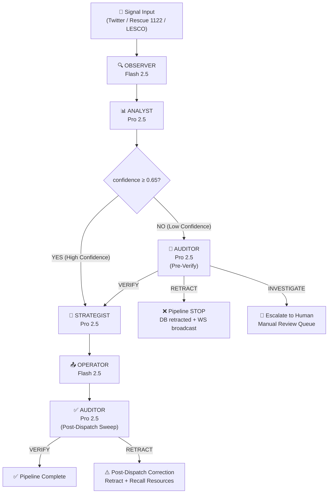
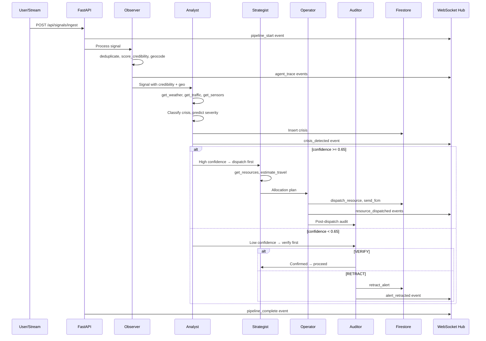

# Tapish — Architecture Deep Dive

## System Architecture

```
┌─────────────────────────────────────────────────────────────────┐
│                       CLIENTS                                    │
│  ┌──────────────┐  ┌────────────────┐  ┌──────────────────────┐ │
│  │ 📱 Flutter    │  │ 🌐 Web Dashboard│  │ 📲 FCM Push          │ │
│  │ Mobile App    │  │ Firebase Host  │  │ Topic: crisis_alerts │ │
│  └──────┬───────┘  └───────┬────────┘  └──────────┬───────────┘ │
│         │ HTTP/WS          │ HTTP/WS               │ FCM        │
│         └────────────────┬─┴───────────────────────┘            │
│                          ▼                                       │
│  ┌────────────────────────────────────────────────────────────┐  │
│  │        CLOUD RUN — FastAPI Backend (Python 3.13)           │  │
│  │                                                            │  │
│  │  REST API (15 endpoints)  ───  WebSocket Hub (3 channels)  │  │
│  │  ├─ /api/signals/ingest   ───  /ws/trace  (agent events)   │  │
│  │  ├─ /api/crises           ───  /ws/alerts (citizen push)   │  │
│  │  ├─ /api/resources        ───  /ws/map    (map updates)    │  │
│  │  ├─ /api/streams/*        │                                │  │
│  │  ├─ /api/simulation/*     │                                │  │
│  │  └─ /api/admin/*          │                                │  │
│  │                           │                                │  │
│  │  ┌─────────────────────────────────────────────────────┐   │  │
│  │  │         ADK ORCHESTRATOR (orchestrator.py)           │   │  │
│  │  │                                                     │   │  │
│  │  │  Signal → Observer → Analyst → {branch}             │   │  │
│  │  │                                                     │   │  │
│  │  │  HIGH CONF (≥0.65):                                 │   │  │
│  │  │    → Strategist → Operator → Auditor (post-sweep)   │   │  │
│  │  │                                                     │   │  │
│  │  │  LOW CONF (<0.65):                                  │   │  │
│  │  │    → Auditor (pre-verify) → {VERIFY} → Strategist   │   │  │
│  │  │                          → {RETRACT} → Pipeline STOP │   │  │
│  │  │                          → {INVESTIGATE} → Escalate  │   │  │
│  │  └─────────────────────────────────────────────────────┘   │  │
│  │                           │                                │  │
│  │  ┌──────────────┐  ┌──────────────┐  ┌──────────────────┐ │  │
│  │  │ Predictor    │  │ Stream Sim   │  │ Degraded Mode   │  │  │
│  │  │ (proactive)  │  │ (Scenarios)  │  │ (Fallbacks)     │  │  │
│  │  └──────────────┘  └──────────────┘  └──────────────────┘ │  │
│  │  ┌──────────────┐                                         │  │
│  │  │ Signal Stream│                                         │  │
│  │  │ Manager      │                                         │  │
│  │  └──────────────┘                                         │  │
│  └────────────────────────────────────────────────────────────┘  │
│                          ▼                                       │
│  ┌────────────────────────────────────────────────────────────┐  │
│  │              CLOUD FIRESTORE (NoSQL)                       │  │
│  │  Collections: signals | crises | traces | resources        │  │
│  │                actions | stakeholder_messages              │  │
│  └────────────────────────────────────────────────────────────┘  │
│                                                                  │
│  ┌────────────────────────────────────────────────────────────┐  │
│  │              GOOGLE AI APIs                                │  │
│  │  Gemini 2.5 Pro — Analyst, Strategist, Auditor            │  │
│  │  Gemini 2.5 Flash — Observer, Operator, Predictor            │  │
│  │  Google Cloud TTS — Urdu mosque announcements             │  │
│  │  Google Maps Geocoding — Location resolution              │  │
│  └────────────────────────────────────────────────────────────┘  │
└─────────────────────────────────────────────────────────────────┘
```

---

## Agent Decision Flow



> **Note:** The diagram above shows the **5-agent reactive pipeline** that runs on every incoming signal. The **6th agent (Predictor)** operates independently — it analyzes weather forecasts to proactively recommend resource pre-positioning *before* a crisis hits. The Predictor uses Gemini 2.5 Flash with `get_weather_forecast`, `get_pser_vulnerability`, and `get_weather_data` tools.

---

## Data Flow



---

## Directory Structure

```
tapish/
├── backend/                          # Python FastAPI server
│   ├── app/
│   │   ├── agents/                   # ADK Agent definitions
│   │   │   ├── orchestrator.py       # Main pipeline (550 lines)
│   │   │   ├── observer.py           # Credibility + geocoding
│   │   │   ├── analyst.py            # Signal fusion + crisis detection
│   │   │   ├── strategist.py         # Resource allocation
│   │   │   ├── operator.py           # Dispatch + notifications
│   │   │   ├── auditor.py            # Verification + retraction
│   │   │   └── predictor.py          # Proactive crisis prediction (runs independently)
│   │   ├── tools/                    # 20 ADK tools across 14 files
│   │   │   ├── credibility_tool.py   # 4-factor credibility scoring
│   │   │   ├── deduplicator_tool.py  # Word-overlap + time dedup
│   │   │   ├── geocode_tool.py       # 28 Lahore locations lookup
│   │   │   ├── weather_tool.py       # Weather data (DEMO: mock, LIVE: Open-Meteo)
│   │   │   ├── traffic_tool.py       # Mock traffic conditions
│   │   │   ├── sensor_readings_tool.py # LESCO grid data
│   │   │   ├── pser_tool.py          # PSER vulnerability index
│   │   │   ├── dispatch_tool.py      # Resource dispatch + hospitals
│   │   │   ├── fcm_tool.py           # Firebase Cloud Messaging (REAL)
│   │   │   ├── tts_tool.py           # Google Cloud TTS Urdu (REAL)
│   │   │   ├── forecast_tool.py      # 48hr weather forecast
│   │   │   ├── vision_tool.py        # Gemini Flash image analysis (REAL)
│   │   │   ├── speech_tool.py        # Gemini Flash Urdu audio transcription (REAL)
│   │   │   └── recent_signals_tool.py # Query recent signals in time window
│   │   ├── services/                 # Backend services
│   │   │   ├── database.py           # Firestore async wrapper
│   │   │   ├── ws_manager.py         # 3-channel WebSocket manager
│   │   │   ├── signal_streams.py     # Auto-ingestion streams
│   │   │   ├── stream_simulator.py   # Scenario-based simulation
│   │   │   ├── degraded_mode.py      # API fallback handlers
│   │   │   └── allocator.py          # PSER-weighted optimizer
│   │   ├── mock/                     # 10 JSON mock data files
│   │   ├── utils/
│   │   │   └── timezone.py           # PKT (UTC+5) utilities
│   │   └── main.py                   # FastAPI entry point
│   ├── Dockerfile
│   └── requirements.txt
│
├── mobile/                           # Flutter mobile app
│   └── lib/
│       ├── screens/                  # 6 app screens
│       │   ├── alerts_screen.dart    # Live crisis alerts feed
│       │   ├── inject_screen.dart    # Signal injection + agent badges
│       │   ├── map_screen.dart       # Google Maps with crisis pins
│       │   ├── trace_screen.dart     # Agent trace console
│       │   ├── stakeholder_screen.dart # Stakeholder messages (6 tabs)
│       │   └── impact_screen.dart    # Impact report + baseline
│       ├── services/
│       │   ├── api_service.dart      # REST API client
│       │   └── ws_service.dart       # WebSocket client
│       ├── providers/                # State management
│       │   ├── alerts_provider.dart
│       │   ├── trace_provider.dart
│       │   └── pipeline_provider.dart
│       ├── theme/
│       │   ├── app_theme.dart        # Material 3 dark theme
│       │   └── app_colors.dart       # Agent + severity colors
│       └── main.dart                 # App entry + splash + nav
│
├── web-next/                         # Next.js command center dashboard
│   ├── app/                          # Next.js App Router pages
│   │   ├── page.tsx                  # Main dashboard (map + waterfall)
│   │   └── layout.tsx                # Root layout + providers
│   ├── components/                   # React components
│   │   ├── CrisisMap.tsx             # Google Maps with crisis overlays
│   │   ├── AgentWaterfall.tsx        # Real-time agent trace panel
│   │   ├── StakeholderInbox.tsx      # 6-tab stakeholder messages
│   │   └── MetricsRibbon.tsx         # Live system metrics
│   └── package.json
│
└── README.md                         # Comprehensive documentation
```

---

## Security & Environment

| Config | Source | Notes |
|---|---|---|
| `GOOGLE_API_KEY` | Cloud Run env var | Gemini API access |
| `FIREBASE_CREDENTIALS_PATH` | Bundled in container | Service account JSON |
| `GOOGLE_MAPS_API_KEY` | Cloud Run env var | Maps Geocoding + JS API |
| Firestore rules | `read: true` | Demo mode (hackathon) |
| FCM topic | `crisis_alerts` | Public subscribe |

---

## Scaling Path

```
Current (Hackathon):
  1 Cloud Run instance, 0 min-instances, 3 max
  → $0/month at rest

10x Scale (City-wide):
  2-3 Cloud Run instances, Firestore auto-scales
  Gemini rate limit: 60 RPM → may need queue
  → ~$50/month

100x Scale (Provincial):
  Pub/Sub for signal queuing
  Dedicated Cloud Run (min-instances=3)
  Firestore compound indexes + TTL policies
  Weather/traffic cache (5-min TTL)
  → ~$500/month
```
