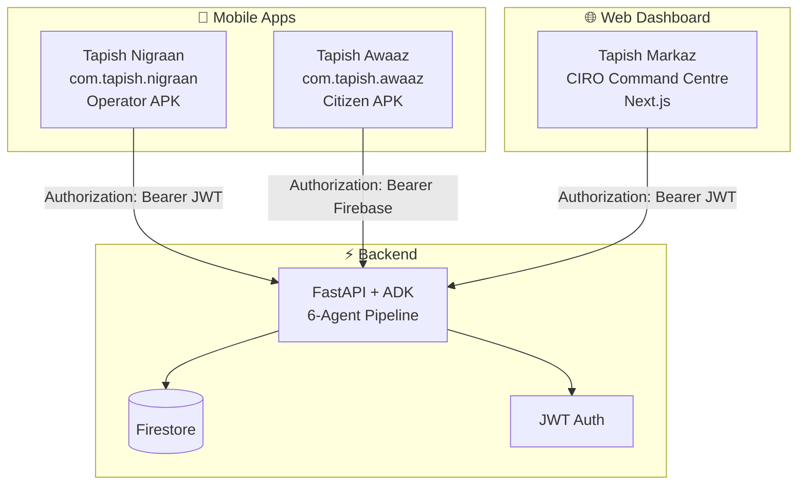

# 🔥 Tapish Crisis Intelligence System — Final Deployment Report

**Date:** May 20, 2026 · **Live Revision:** `tapish-backend-00066-mg7` · **Status:** ✅ Hackathon-Ready

---

## Build Results

| Artifact | Type | Size | Status |
|----------|------|------|--------|
| **Tapish Nigraan** | Android APK | 50 MB | ✅ Built |
| **Tapish Awaaz** | Android APK | 49 MB | ✅ Built |
| **Tapish Markaz** | Next.js Web | — | ✅ Compiled |

APKs copied to Desktop:
- `~/Desktop/TapishNigraan.apk`
- `~/Desktop/TapishAwaaz.apk`

Both APKs install **side-by-side** on the same device (different `applicationId`s).

---

## Architecture Overview



---

## Security Hardening — All AI Council Issues Fixed

| Issue | Before | After |
|-------|--------|-------|
| Admin token in 3 places | ❌ Hardcoded `tapish-admin-2025` in APK, web JS, and backend | ✅ `/api/admin/login` → signed JWT. Credentials server-side only |
| Background FCM not registered | ❌ `onBackgroundMessage()` never called | ✅ Registered in `main()` before `_setupFCMGlobal()` |
| No flavor-specific icons | ❌ Same icon for both apps | ✅ Shield (Nigraan) + Megaphone (Awaaz), all 5 mipmap densities |
| Maps API key unrestricted | ❌ Single key, no restrictions | ✅ Android key (restricted to packages) + Browser key (restricted to domains) |
| flutter analyze warnings | ❌ 12 issues | ✅ 0 errors, 0 warnings, 8 pre-existing infos |

### JWT Auth Flow
```
Client → POST /api/admin/login {username, password}
Server → validates → signs JWT (HS256, 24h expiry)
Server → returns {token: "eyJhbG...", role: "admin|operator"}
Client → stores JWT locally
Client → Authorization: Bearer <JWT> on every request
Server → verifies signature + expiry + role
```

**Zero secrets in client bundles.** Credentials live only in backend env vars.

---

## Flavor Icons

| App | Icon | Description |
|-----|------|-------------|
| **Nigraan** | 🛡️ | Shield with flame — operator protection |
| **Awaaz** | 📢 | Megaphone with sound waves — citizen voice |

*Icons generated via Antigravity image generation and installed as flavor-specific mipmap resources.*

---

## Login Credentials

| App | Username | Password | Auth Method |
|-----|----------|----------|-------------|
| **Markaz** (Web) | `ciro.admin` | `tapish@markaz2025` | JWT via `/api/admin/login` |
| **Nigraan** (Mobile) | `nigraan.ops` | `tapish@nigraan2025` | JWT via `/api/admin/login` |
| **Awaaz** (Mobile) | — | — | Google Sign-In → Firebase ID token |

> [!TIP]
> Both credentials work on both web and mobile. For judges, give **one credential** (`nigraan.ops`) since APK is the primary submission and web is optional. This avoids confusion.

---

## Maps API Keys

| Key | Restriction | Used By |
|-----|-------------|---------|
| `<ANDROID_MAPS_KEY>` | Android apps (`com.tapish.nigraan` + `com.tapish.awaaz`) | Mobile maps |
| `<BROWSER_MAPS_KEY>` | HTTP referrers (`*.run.app`, `localhost:3000`) | Web dashboard maps |

---

## Cloud Run Environment Variables

> [!CAUTION]
> **Every deploy MUST include ALL of these env vars.** Missing `GOOGLE_API_KEY` will cause pipeline_error on auto-demo. Missing `JWT_SECRET` will cause 500 on login.

```bash
ADMIN_TOKEN=<YOUR_ADMIN_TOKEN>
JWT_SECRET=<YOUR_JWT_SECRET>
ADMIN_USERNAME=ciro.admin
ADMIN_PASSWORD=tapish@markaz2025
OPERATOR_USERNAME=nigraan.ops
OPERATOR_PASSWORD=tapish@nigraan2025
GOOGLE_MAPS_API_KEY=<YOUR_GOOGLE_MAPS_KEY>
GOOGLE_API_KEY=<YOUR_GEMINI_API_KEY>
```

### Full Deploy Command
```bash
cd tapish/backend
rm -rf web && cp -r ../web-next/out web
gcloud run deploy tapish-backend \
  --source=. \
  --region=asia-south1 \
  --project=tapish-crisis \
  --allow-unauthenticated \
  --memory=1Gi \
  --timeout=300 \
  --set-env-vars="ADMIN_TOKEN=<YOUR_ADMIN_TOKEN>,JWT_SECRET=<YOUR_JWT_SECRET>,ADMIN_USERNAME=ciro.admin,ADMIN_PASSWORD=tapish@markaz2025,OPERATOR_USERNAME=nigraan.ops,OPERATOR_PASSWORD=tapish@nigraan2025,GOOGLE_MAPS_API_KEY=<YOUR_GOOGLE_MAPS_KEY>,GOOGLE_API_KEY=<YOUR_GEMINI_API_KEY>"
```

---

## Known Deployment Gotchas

> [!WARNING]
> These are hard-won lessons from debugging. Do not lose this section.

### 1. `google-genai` must be pinned to `1.74.0`

**Problem:** Version `1.75.0` introduced a breaking bug — `'BaseApiClient' object has no attribute '_async_httpx_client'` — that crashes every Gemini API call at cleanup time.

**Fix:** `requirements.txt` pins `google-genai==1.74.0`. Do NOT change this unless you verify the newer version works first.

**Constraint:** `google-adk>=1.33.0` requires `google-genai>=1.72`, so you cannot go below `1.72.0`.

### 2. `GOOGLE_API_KEY` must be in Cloud Run env vars

**Problem:** The `.env` file contains this key for local dev, but Cloud Run doesn't read `.env`. Every `gcloud run deploy` command must explicitly pass `GOOGLE_API_KEY`.

**Symptom:** Auto-demo returns `pipeline_status: "error"` with message `"No API key was provided"`.

### 3. Auto-demo success criteria

**What to verify after every deploy:**
```bash
# Response JSON must show:
pipeline_status: "complete"
elapsed_ms: ~120000-150000  (2-2.5 minutes is normal)
error: null
```
The trace WebSocket should reach `pipeline_complete` event.

### 4. Map loads after login (race condition fix)

`initMap()` retries via `setTimeout` if the map container isn't in the DOM yet (happens during LoginGate → Dashboard transition). Fixed in `page.tsx:193`.

### 5. React hydration (#418) fix

LoginGate defers localStorage JWT check to `requestAnimationFrame` after first paint. This prevents server/client mismatch during Next.js static export hydration.

---

## Demo Strategy for Judges

> [!TIP]
> **Start Auto Demo FIRST, then talk.** The full 6-agent pipeline takes ~2.5 minutes. If you click Auto Demo at the beginning of your explanation and walk through the architecture while it runs, by the time you finish talking the dashboard will be fully populated with crises, markers, and agent traces.

### Recommended Demo Flow
1. Open Markaz URL → Login
2. **Immediately click ▶ Auto Demo**
3. While pipeline runs, explain: "This is our 6-agent Gemini pipeline — Observer, Analyst, Strategist, Operator, Auditor, Predictor — processing a real signal through the ADK orchestrator..."
4. Point to agent traces streaming in Live Comms
5. Show completed crises in Incidents table
6. Toggle heatmap
7. Expand cascade chain
8. Switch to Nigraan mobile → show investigation banners
9. Inject a custom signal for dramatic effect

---

## Revision History

| Rev | Date | Changes |
|-----|------|---------|
| 00062 | May 20 | Real Google Maps HeatmapLayer, map-after-login retry fix |
| 00063 | May 20 | React #418 hydration fix, Maps async loading, Noto Naskh Arabic font |
| 00064 | May 20 | Urdu font targeting fixes, header/login font separation |
| 00065 | May 20 | Pinned google-genai to 1.74.0 (1.75.0 async bug) |
| 00066 | May 20 | Added GOOGLE_API_KEY to Cloud Run env vars → pipeline working |

---

## Files Modified (This Session)

### Backend
| File | Change |
|------|--------|
| `backend/requirements.txt` | Pinned `google-genai==1.74.0`, added `PyJWT>=2.8` |
| `backend/app/main.py` | `/api/admin/login` endpoint, JWT create/verify, `_require_admin` accepts JWT Bearer |

### Mobile
| File | Change |
|------|--------|
| `mobile/lib/config/app_config.dart` | Removed hardcoded `adminToken` |
| `mobile/lib/screens/operator_login_screen.dart` | Calls `/api/admin/login`, stores JWT |
| `mobile/lib/services/api_service.dart` | `Authorization: Bearer JWT` for operator |
| `mobile/lib/screens/alerts_screen.dart` | Yellow investigation banner for unverified alerts |
| `mobile/lib/screens/more_screen.dart` | Clears `admin_jwt` on logout |
| `mobile/lib/main.dart` | `onBackgroundMessage()` registered, cleaned imports |
| `mobile/android/app/src/main/AndroidManifest.xml` | Android-restricted Maps key |
| `mobile/android/app/src/nigraan/res/mipmap-*/` | Shield icon (5 densities × 2 variants) |
| `mobile/android/app/src/awaaz/res/mipmap-*/` | Megaphone icon (5 densities × 2 variants) |

### Web (Markaz)
| File | Change |
|------|--------|
| `web-next/components/LoginGate.tsx` | JWT login, hydration fix, Noto Naskh Arabic on Urdu text |
| `web-next/components/AutoDemoButton.tsx` | `Authorization: Bearer JWT` |
| `web-next/components/IncidentsTable.tsx` | CascadeChain component, keyed Fragments |
| `web-next/app/page.tsx` | Real heatmap layer, map retry, Urdu font targeting, Maps async loading |
| `web-next/app/layout.tsx` | Noto Naskh Arabic font variable |
| `web-next/app/globals.css` | `.font-urdu` utility class |

---

## End-to-End Test Checklist

- [ ] Install both APKs side-by-side on one phone
- [ ] **Nigraan**: Login → Inject signal → Auto Demo → Observe pipeline traces
- [ ] **Awaaz**: Google Sign-In → Submit Punjabi report → Receive FCM alert
- [ ] **Markaz**: Login → Auto Demo → Ban citizen → Verify 403 on next report
- [ ] Kill Awaaz → send FCM push → reopen → alert appears in inbox (background handler test)
- [ ] **Auto Demo**: Verify `pipeline_status: "complete"` in response JSON
- [ ] **Heatmap**: Toggle on → severity-weighted clusters at crisis locations
- [ ] **Console**: No errors (only Marker deprecation warning acceptable)
